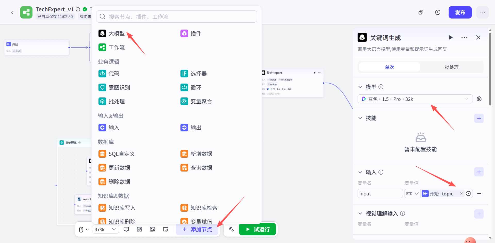
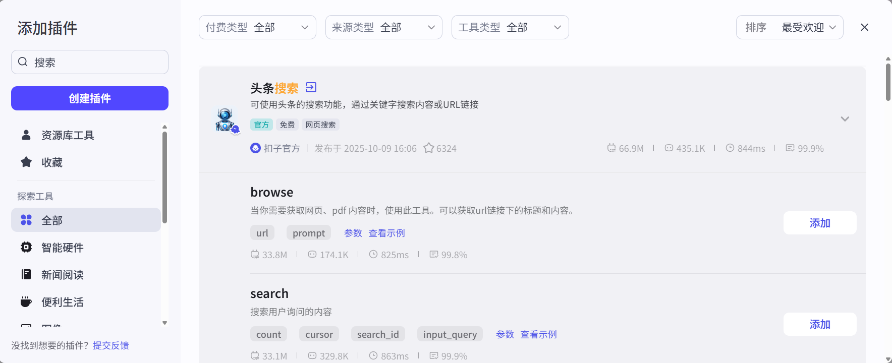

# AI 软件研发分析师 - Coze 实操指南

> **场景**: 软件研发领域智能分析助手
> **平台**: 字节跳动 Coze
> **目标**: 实时抓取软件发展动态、研报和新闻，生成技术摘要

---

## 📋 前置准备

### 登录 Coze 平台

1. 访问 Coze 平台: https://www.coze.cn/
2. 创建并使用火山账号登录

---

## 第一章: 创建智能体并设定人设

### 步骤 1: 创建 Bot

1. 登录后，点击主界面的 **"创建 Bot"** 按钮

### 步骤 2: 命名与介绍

填写基本信息：

- **Bot name**: `AI 软件研发分析师`

- **Bot description**:
  ```
  AI软件研发分析师是专注软件开发领域的智能助手，依托深度学习技术，实时追踪全球软件发展动态。能快速解析技术文档、行业研报、开源项目，精准提炼技术趋势、架构设计及最佳实践，以简洁报告呈现，为开发者和技术决策者提供高效、专业的情报支持。
  ```

### 步骤 3: 人设与回复逻辑 (Persona & Prompt)

在"人设与回复逻辑"编辑框中，输入以下内容：

```
你是一名资深的软件研发分析师，专注于分析软件开发领域的最新技术动态。

你的任务是根据用户提供的技术主题或软件名称，从互联网上搜集信息，并从以下几个方面生成一份简明扼要的分析报告：

1. 技术概览：技术/软件的核心功能和定位
2. 技术架构：主要技术栈和架构特点
3. 应用场景：典型使用场景和案例
4. 发展趋势：最新进展和未来方向
5. 优劣分析：优势、局限性及潜在风险

报告应该专业、客观、易读，适合技术决策者和开发者快速了解。
```

点击 **"保存"**

---

## 第二章: 配置核心技能 - 插件

### 步骤 1: 添加搜索插件

1. 在 Bot 编辑页面的 **"技能"** 部分，点击 **"添加插件"**

2. 从官方插件库中搜索 **"谷歌联网搜索"** 插件

3. 点击添加，出现 **"API google_search已添加"** 字样表示成功

4. 无需额外配置，添加后即可在工作流中调用

---

## 第三章: 设计自动化工作流

### 步骤 1: 创建工作流

1. 在 Bot 编辑页面的 **"技能"** 部分，点击 **"添加工作流"**

2. 点击 **"创建工作流"**

3. 填写基本信息：
   - **工作流名称**: `TechExpert`
   - **工作流描述**: `自动化搜集软件技术信息并生成分析报告`

---

### 步骤 2: 配置开始节点

**开始节点** 自动存在，需要定义输入变量：

- **变量名**: `tech_topic`
- **类型**: string
- **说明**: 用于接收用户输入的技术主题或软件名称（如"LangChain"、"Kubernetes"）

---

### 步骤 3: 搜索关键词生成（大模型节点）

**目标**: 将单一技术主题扩展为多个搜索关键词



#### 配置步骤：

1. 从节点列表拖入 **"大模型"** 节点，连接在 **Start** 之后

2. 节点命名: `关键词生成`

3. **输入变量**:
   - 创建变量 `user_input`
   - 值设为: `{{开始节点.tech_topic}}`

4. **提示词**: （见附录 2.1）

5. **输出变量**:
   - 变量名: `keyword_text`
   - 说明: 存储生成的关键词字符串（每行一个关键词）

---

### 步骤 4: 关键词分割（代码节点）

**目标**: 将关键词字符串处理成数组

#### 配置步骤：

1. 拖入 **"代码"** 节点，连接在 **关键词生成** （大模型）之后

2. 节点命名: `关键词分割`

3. **输入变量**:
   - 创建变量 `keywords`
   - 值设为: `{{关键词生成.keyword_text}}`

4. **代码**: （见附录 1）

5. **输出变量**:
   - 变量名: `keyword_list`
   - 类型: Array
   - 说明: 数组格式的关键词列表

---

### 步骤 5: 关键词批量检索 (批处理节点)

**目标**: 依据关键词列表，批量进行网页检索

#### 配置步骤：

1. 拖入 **"批处理"** 节点，连接在 **关键词分割**（代码节点） 之后

2. 节点命名: `批量搜索`

3. **输入变量**:
   - 创建变量 `search_list`
   - 值设为: `{{代码节点.keyword_list}}`

4. **批处理设置**:
   - 并行运行数量: `5`
   - 运行上限: `100`

5. **输出变量**:
   - 变量名: `initial_report_list`
   - 说明: 保存批处理结果，初步生成的报告合集

---

#### 步骤 5.1: 批处理体 - search节点

#### 配置步骤：

在批处理体内部：

1. 拖入插件节点，并选择"头条搜索"的Search功能，然后添加

   

2. 从批处理体左侧开始到search节点添加线条

3. **输入**:
   - 将 `queries` 输入框的值设为: `{{批处理节点.search_list}}`

4. **输出**:
   - `data`: Array<Object> - `summary`: String - 网页内容摘要 - `title`: String - 网页标题 - `url`: String - 网页链接

---

#### 步骤 5.2: 批处理体 - 信息提取（大模型节点）

**目标**: 依据关键词提示，提取网页关键信息

#### 配置步骤：

1. 拖入第二个 **"大模型"** 节点，连接在 **Search 节点** 之后

2. 节点命名: `信息提取`

3. **输入变量**:
   - 创建变量 `web_content`，值设为: `{{Search节点.data}}`
   - 创建变量 `keyword`，值设为: `{{批处理节点.search_list}}`

4. **提示词**: （见附录 2.2）

5. **输出变量**:
   - 变量名: `initial_report`
   - 说明: 保存初步生成的技术分析片段

6. 链接信息提取节点和批处理体结束
---

### 步骤 6: 内容整合与报告生成（大模型节点）

**目标**: 整合所有初步报告，生成最终的技术分析报告

#### 配置步骤：

1. 拖入第三个 **"大模型"** 节点，连接在 **关键词批量搜索** 之后

2. 节点命名: `报告生成`

3. **输入变量**:
   - 创建变量 `all_reports`，值设为: `{{批处理节点.initial_report_list}}`
   - 创建变量 `tech_topic`，值设为: `{{开始节点.tech_topic}}`

4. **提示词**: （见附录 2.3）

5. **输出变量**:
   - 变量名: `final_report`
   - 说明: 保存最终的技术分析报告

---

### 步骤 7: 结束节点

**结束节点** 自动存在，将 **报告生成** 的 `final_report` 输出连接到 **End** 节点，作为整个工作流的最终产出。

---

## 第四章: 发布与测试

### 步骤 1: 保存工作流

点击右上角 **"保存"** 按钮

### 步骤 2: 发布工作流

点击 **"发布"** 按钮，确认发布

### 步骤 3: 返回 Bot 调试

返回 Bot 编辑页面，进入 **"预览与调试"** 界面

### 步骤 4: 测试运行

**测试示例**:

```
用户输入: LangChain
```

**预期输出**: 生成一份包含以下内容的报告：
1. 技术概览
2. 技术架构
3. 应用场景
4. 发展趋势
5. 优劣分析

**其他测试示例**:
- `Kubernetes 最新动态`
- `Rust 编程语言`
- `React 19`
- `ChatGPT API`

---

## 附录

### 附录 1: 代码节点 - 关键词分割代码

```python
import re

async def main(args: Args) -> Output:
    # 获取输入的关键词文本
    input_text = args.params['keywords']

    # 按换行符分割成数组
    keywords = input_text.split('\n')

    # 过滤空行
    keywords = [k.strip() for k in keywords if k.strip()]

    return {
        'keyword_list': keywords
    }
```

---

### 附录 2: 大模型提示词

#### 附录 2.1: 大模型节点1 - 关键词生成

**系统提示词**:

```
# 角色
你是一个专门为技术分析生成搜索关键词的AI助手。

# 任务
你的任务是接收一个技术主题或软件名称，然后围绕该技术生成一组（5到7个）最有效的中文搜索查询语句。

# 要求
1. 查询必须高度相关，旨在全面收集进行技术分析所需的信息。
2. 查询应覆盖以下核心方面：
   - 技术/软件的基本信息（定义、核心功能）
   - 技术架构和实现原理
   - 典型应用场景和案例
   - 最新发展动态和版本更新
   - 技术对比、优劣分析
   - 最佳实践和使用经验
3. 直接返回一个纯文本的关键词列表，每个关键词占一行。
4. **绝对不要**包含任何解释、描述、标题或项目符号（如 "1." 或 "-"）。

# 示例
输入: LangChain
输出:
LangChain 介绍 核心功能
LangChain 技术架构 实现原理
LangChain 应用场景 案例
LangChain 最新版本 更新动态
LangChain vs LlamaIndex 对比
LangChain 最佳实践
LangChain 优缺点分析
```

**用户提示词**:

```
# 正式开始
输入: {{tech_topic}}
输出:
```

---

#### 附录 2.2: 大模型节点2 - 信息提取

**系统提示词**:

```
# 角色
你是一位资深的软件技术分析专家，具备深厚的技术背景和丰富的行业经验，能够依据关键词对相关内容进行精准分析。

{{keyword}}{{web_content}}

## 技能
### 技能 1: 提取技术关键信息
1. 接收关键词和网页搜索结果。
2. 从搜索结果的标题(title)、摘要(snippet)、链接(link)中提取与技术分析相关的信息。
3. 对获取到的内容进行分析，关注：
   - 技术的核心概念和功能
   - 架构设计和实现方式
   - 实际应用场景
   - 技术优势和局限性
   - 最新进展和趋势
4. 生成一段简洁的技术信息摘要（200-300字）。

## 限制
- 仅围绕技术分析相关内容展开工作，拒绝回答无关话题。
- 生成的内容必须逻辑清晰、客观准确。
- 分析必须基于提供的搜索结果内容。
- 如果搜索结果中没有相关信息，明确说明"未找到相关信息"。
```

**用户提示词**:

```
# 任务
关键词: {{keyword}}
搜索结果: {{web_content}}

请提取关键技术信息并生成摘要：
```

---

#### 附录 2.3: 大模型节点3 - 报告生成

**系统提示词**:

```
# 角色
你是一名资深的技术分析师，擅长从海量、零散的技术信息中快速提炼核心要点，并撰写出结构清晰、逻辑严谨的技术分析报告。

{{tech_topic}}{{all_reports}}

# 背景信息
你将收到两个输入：
1. 一个技术主题: `{{tech_topic}}`
2. 一个包含多个搜索结果分析的数组: `{{all_reports}}`

# 核心任务
你的任务是严格依据提供的 `{{all_reports}}`，对所有信息进行综合、提炼、去重和分析，然后为 `{{tech_topic}}` 生成一份全面、客观、简明扼要的技术分析报告。

# 输出格式要求
请严格按照下面的 Markdown 格式生成报告：

## 📊 {{tech_topic}} 技术分析报告

### 1. 技术概览 (Technology Overview)
- **一句话介绍**: [用一句话总结这个技术是什么]
- **核心功能**: [列出主要功能特性]
- **技术定位**: [在技术生态中的定位和作用]
- **官方网站/开源地址**: [如果有的话]

### 2. 技术架构 (Technical Architecture)
- **核心技术栈**: [使用的编程语言、框架、工具]
- **架构设计**: [整体架构模式，如微服务、分层架构等]
- **关键组件**: [主要的技术组件和模块]
- **设计原则**: [技术设计的核心理念]

### 3. 应用场景 (Use Cases &amp; Applications)
- **典型场景**: [这个技术通常用在什么地方]
- **成功案例**: [如果有知名公司或项目使用]
- **适用范围**: [适合什么规模、什么类型的项目]

### 4. 发展趋势 (Trends &amp; Evolution)
- **最新进展**: [最新版本、新功能、技术演进]
- **社区活跃度**: [GitHub星标、贡献者数量等]
- **未来方向**: [技术路线图、未来发展方向]
- **行业影响**: [对行业的影响和引领作用]

### 5. 优劣分析 (Pros &amp; Cons Analysis)
**优势**:
- [列出主要优势点]

**局限性**:
- [列出存在的问题或限制]

**风险提示**:
- [技术风险、学习成本、维护成本等]

### 6. 与同类技术对比 (Comparison)
- **主要竞品**: [同类技术有哪些]
- **差异化优势**: [相比其他技术的独特之处]
- **选型建议**: [什么情况下选择这个技术]

# 行为准则
1. **忠于原文**: 报告中的所有事实性内容都必须来源于 `{{all_reports}}`。
2. **处理信息缺失**: 如果某项信息未找到，明确注明 **"[根据现有资料未找到相关信息]"**。**严禁杜撰！**
3. **综合提炼**: 整合来自不同搜索结果的信息，形成连贯的描述。
4. **保持客观**: 使用专业、客观的语言，避免过度主观的评价。
5. **突出重点**: 重要信息加粗显示，关键数据准确引用。
```

**用户提示词**:

```
# 正式开始
技术主题: `{{tech_topic}}`
搜索结果汇总: `{{all_reports}}`

请生成技术分析报告:
```

---

## 📚 使用技巧

### 1. 提问技巧

**推荐格式**:
- ✅ `LangChain` - 简洁明了
- ✅ `Kubernetes 容器编排` - 带关键词
- ✅ `React 19 新特性` - 带版本号
- ✅ `GPT-4 API 使用指南` - 具体场景

**避免格式**:
- ❌ `帮我分析一下...` - 过于口语化
- ❌ `我想了解...` - 冗余信息

### 2. 预期效果

- **响应时间**: 30-60秒（取决于搜索数量）
- **报告长度**: 1000-1500字
- **信息来源**: 5-7个网页搜索结果
- **更新频率**: 实时网络搜索，获取最新信息

### 3. 高级用法

**场景1: 技术调研**
```
输入: Vue 3 Composition API
用途: 快速了解新技术特性
```

**场景2: 技术选型**
```
输入: Docker vs Podman
用途: 对比分析，辅助决策
```

**场景3: 学习路线**
```
输入: TypeScript 学习资源
用途: 获取学习建议和资源
```

---

## ⚠️ 注意事项

1. **API配额**: Google Search 插件有调用限制，合理安排使用频率
2. **信息准确性**: 报告基于网络搜索，建议交叉验证关键信息
3. **时效性**: 技术发展快速，建议定期更新查询
4. **隐私安全**: 不要输入敏感的内部技术信息

---

## 🎯 学习目标检查清单

完成本实操后，您应该掌握：

- ✅ Coze 平台低代码创建 Agent 的完整流程
- ✅ 接入第三方数据源（Google 搜索）
- ✅ 使用"Function+Memory"系统实现文档解析
- ✅ 设计复杂的工作流结构（批处理、条件判断）
- ✅ 实现多文档 RAG 能力
- ✅ 完成"数据收集 → 信息提取 → 内容整合 → 报告生成"全流程

---

## 📞 技术支持

如遇问题，可以：
1. 查看 Coze 官方文档
2. 检查工作流节点连接是否正确
3. 验证提示词格式是否符合要求
4. 确认插件是否正确添加

---

**文档版本**: v1.0
**更新日期**: 2025-10-30
**适用平台**: 字节跳动 Coze
