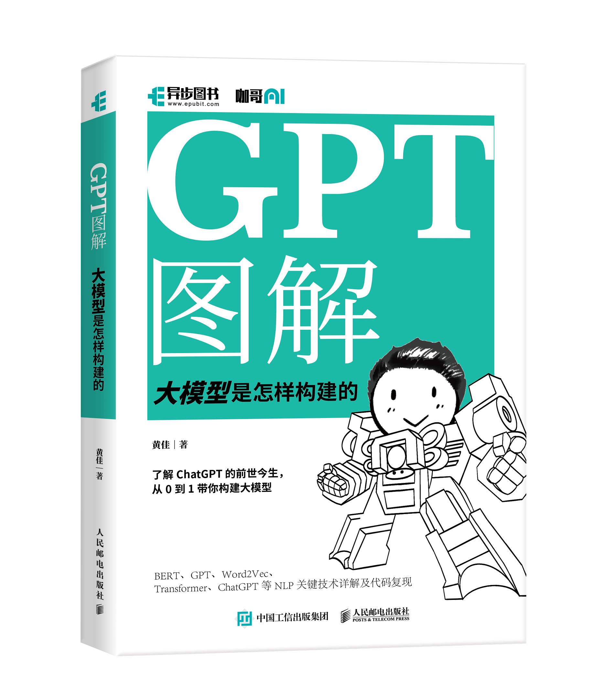
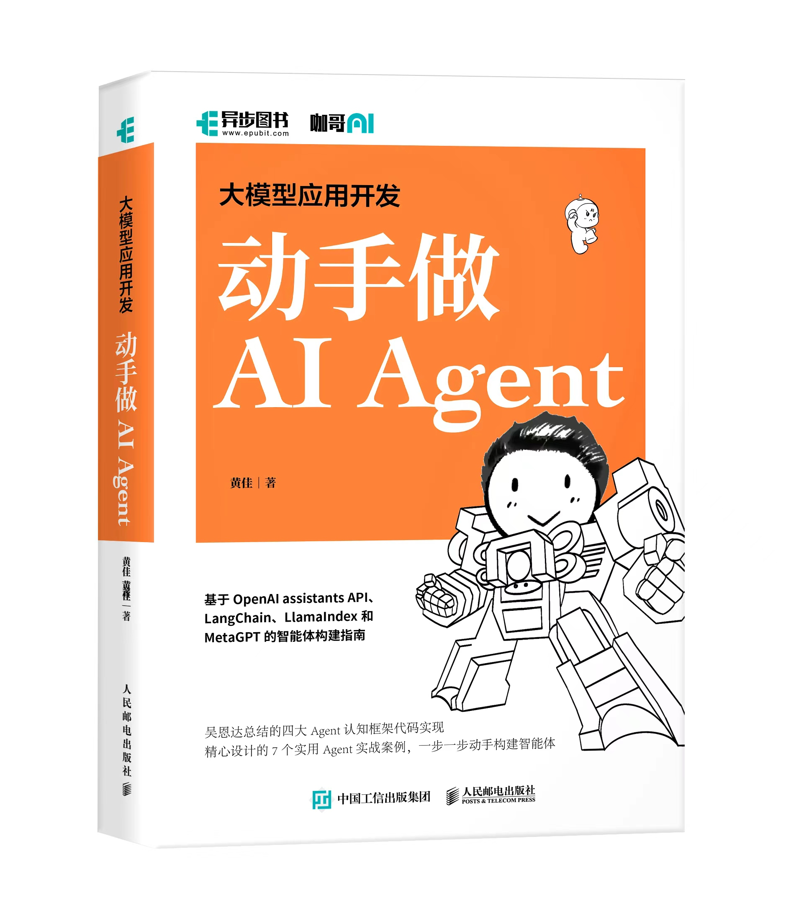
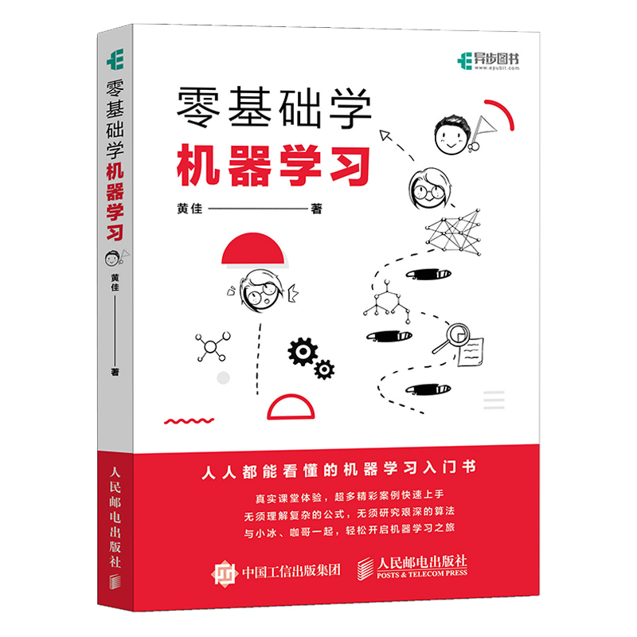
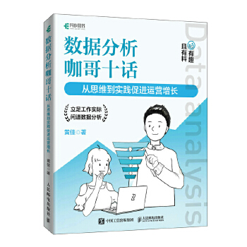

# 异步图书 大模型应用开发 动手做AI Agent

支持佳哥：购书[链接](https://item.jd.com/14600442.html)

## GPT图解

说明：这本书详细解释了GPT模型的内部结构和工作原理。
[购买链接](https://item.jd.com/14600442.html)

## 动手做Agent

说明：这本书指导读者如何从零开始动手制作AI Agent。
[购买链接](https://item.jd.com/13958977.html)

## 机器学习

说明：这本书深入探讨了机器学习的理论和实践。
[购买链接](https://item.jd.com/12763913.html)

## 数据分析

说明：这本书介绍了数据分析的基本方法和工具。
[购买链接](https://item.jd.com/13335199.html)

