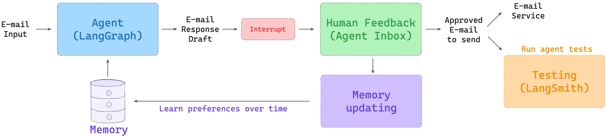
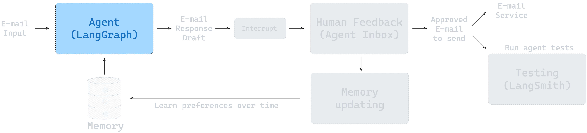
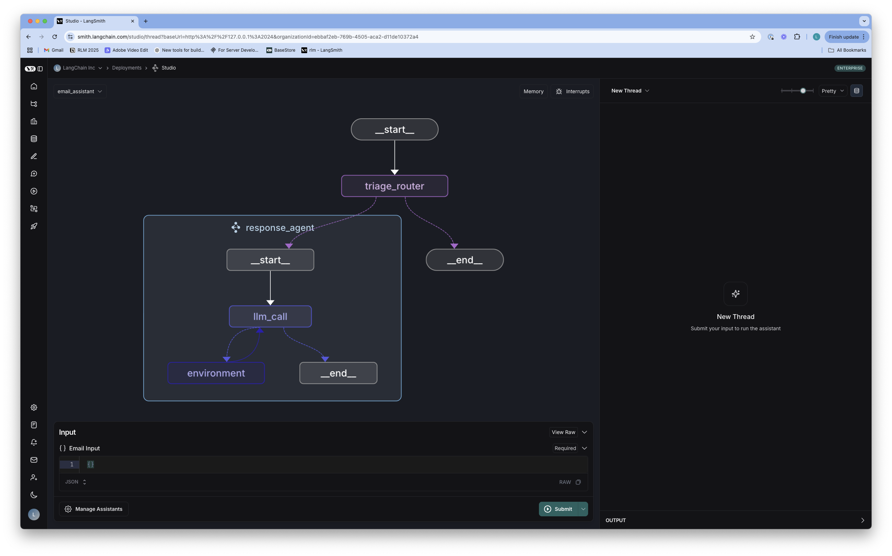
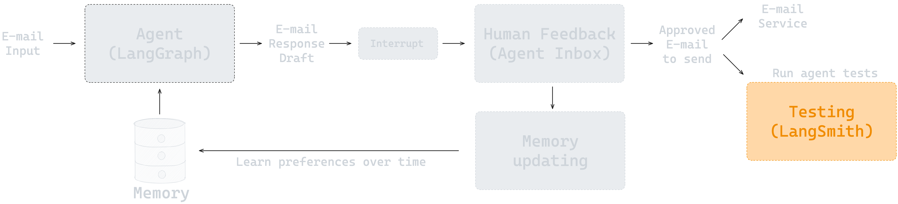
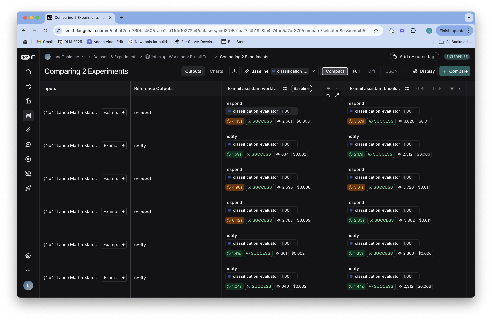
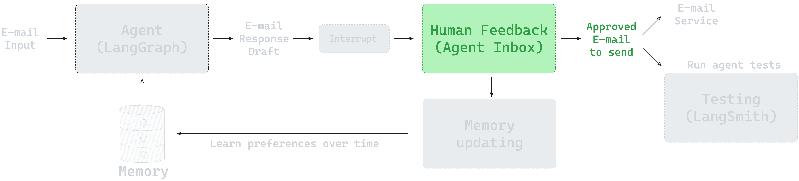
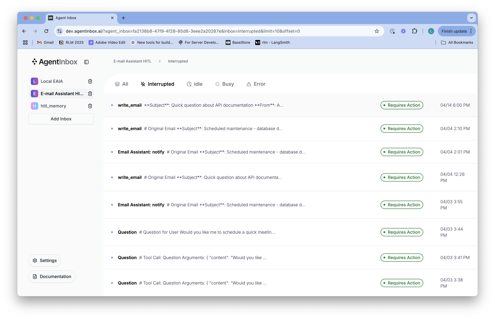
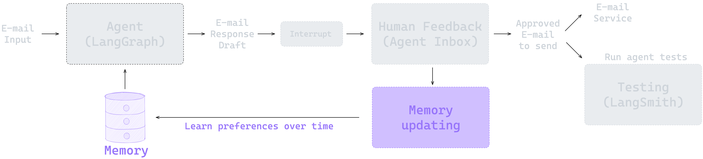

# 从零开始构建智能体

该仓库是从零开始构建智能体的指南。它逐步构建到一个可以通过 Gmail API 连接管理您的电子邮件的["环境"](https://blog.langchain.dev/introducing-ambient-agents/)智能体。它分为4个部分，每个部分都有一个notebook和 `src/email_assistant` 目录中的相应代码。这些部分从智能体的基础知识开始，到智能体评估，到人工干预，最后到记忆。这些都在一个您可以部署的智能体中汇聚在一起，这些原则可以应用于各种任务的其他智能体。



## 环境设置

### Python 版本

* 确保您使用的是 Python 3.11 或更高版本。
* 该版本是与 LangGraph 最佳兼容性所必需的。

```shell
python3 --version
```

### API 密钥

* 如果您没有 OpenAI API 密钥，可以在[这里](https://openai.com/index/openai-api/)注册。
* 在[这里](https://smith.langchain.com/)注册 LangSmith。
* 生成 LangSmith API 密钥。

### 设置环境变量

* 在根目录中创建 `.env` 文件：
```shell
# 将 .env.example 文件复制为 .env
cp .env.example .env
```

* 使用以下内容编辑 `.env` 文件：
```shell
LANGSMITH_API_KEY=your_langsmith_api_key
LANGSMITH_TRACING=true
LANGSMITH_PROJECT="interrupt-workshop"
OPENAI_API_KEY=your_openai_api_key
```

* 您也可以在终端中设置环境变量：
```shell
export LANGSMITH_API_KEY=your_langsmith_api_key
export LANGSMITH_TRACING=true
export OPENAI_API_KEY=your_openai_api_key
```

### 包安装

**推荐：使用 uv（更快更可靠）**

```shell
# 如果还没有安装 uv
pip install uv

# 安装带有开发依赖的包
uv sync --extra dev

# 激活虚拟环境
source .venv/bin/activate
```

**替代方案：使用 pip**

```shell
$ python3 -m venv .venv
$ source .venv/bin/activate
# 确保您有最新版本的 pip（带有 pyproject.toml 的可编辑安装需要）
$ python3 -m pip install --upgrade pip
# 以可编辑模式安装包
$ pip install -e .
```

> **⚠️ 重要**：不要跳过包安装步骤！这个可编辑安装对于notebook的正确工作是**必需的**。包安装为 `interrupt_workshop`，导入名称为 `email_assistant`，允许您使用 `from email_assistant import ...` 从任何地方导入。

## 结构

该仓库分为4个部分，每个部分都有一个notebook和 `src/email_assistant` 目录中的相应代码。

### 前言：LangGraph 101
有关 LangGraph 的简要介绍和此仓库中使用的一些概念，请参阅 [LangGraph 101 notebook](notebooks/langgraph_101.ipynb)。此notebook解释了聊天模型、工具调用、智能体与工作流、LangGraph 节点/边/记忆和 LangGraph Studio 的基础知识。

### 构建智能体
* Notebook: [notebooks/agent.ipynb](/notebooks/agent.ipynb)
* 代码: [src/email_assistant/email_assistant.py](/src/email_assistant/email_assistant.py)



此notebook展示了如何构建电子邮件助手，将[电子邮件分类步骤](https://langchain-ai.github.io/langgraph/tutorials/workflows/)与处理电子邮件响应的智能体相结合。您可以在 `src/email_assistant/email_assistant.py` 中查看完整实现的链接代码。



### 评估
* Notebook: [notebooks/evaluation.ipynb](/notebooks/evaluation.ipynb)



此notebook介绍了使用 [eval/email_dataset.py](/eval/email_dataset.py) 中的电子邮件数据集进行评估。它展示了如何使用 Pytest 和 LangSmith `evaluate` API 运行评估。它运行使用 LLM 作为评判者的电子邮件响应评估以及工具调用和分类决策的评估。



### 人工干预
* Notebook: [notebooks/hitl.ipynb](/notebooks/hitl.ipynb)
* 代码: [src/email_assistant/email_assistant_hitl.py](/src/email_assistant/email_assistant_hitl.py)



此notebook展示了如何添加人工干预（HITL），允许用户审查特定的工具调用（例如，发送电子邮件、安排会议）。为此，我们使用 [Agent Inbox](https://github.com/langchain-ai/agent-inbox) 作为人工干预的界面。您可以在 [src/email_assistant/email_assistant_hitl.py](/src/email_assistant/email_assistant_hitl.py) 中查看完整实现的链接代码。



### 记忆
* Notebook: [notebooks/memory.ipynb](/notebooks/memory.ipynb)
* 代码: [src/email_assistant/email_assistant_hitl_memory.py](/src/email_assistant/email_assistant_hitl_memory.py)



此notebook展示了如何为电子邮件助手添加记忆，允许它从用户反馈中学习并随时间适应偏好。启用记忆的助手（[email_assistant_hitl_memory.py](/src/email_assistant/email_assistant_hitl_memory.py)）使用 [LangGraph Store](https://langchain-ai.github.io/langgraph/concepts/memory/#long-term-memory) 来持久化记忆。您可以在 [src/email_assistant/email_assistant_hitl_memory.py](/src/email_assistant/email_assistant_hitl_memory.py) 中查看完整实现的链接代码。

## 连接到 API

上述notebook使用模拟的电子邮件和日历工具。

### Gmail 集成和部署

按照 [Gmail Tools README](src/email_assistant/tools/gmail/README.md) 中的说明设置 Google API 凭据。

该 README 还解释了如何将图部署到 LangGraph Platform。

Gmail 集成的完整实现在 [src/email_assistant/email_assistant_hitl_memory_gmail.py](/src/email_assistant/email_assistant_hitl_memory_gmail.py) 中。

## 运行测试

该仓库包含一个自动化测试套件来评估电子邮件助手。

测试验证正确的工具使用和响应质量，使用 LangSmith 进行跟踪。

### 使用 [run_all_tests.py](/tests/run_all_tests.py) 运行测试

```shell
python tests/run_all_tests.py
```

### 测试结果

测试结果记录到 LangSmith，在您的 `.env` 文件中指定的项目名称下（`LANGSMITH_PROJECT`）。这提供：
- 智能体跟踪的可视化检查
- 详细的评估指标
- 不同智能体实现的比较

### 可用的测试实现

可用于测试的实现有：
- `email_assistant` - 基本电子邮件助手

### 测试 Notebook

您还可以运行测试来验证所有notebook都能正确执行：

```shell
# 运行所有notebook测试
python tests/test_notebooks.py

# 或通过pytest运行
pytest tests/test_notebooks.py -v
```

## 未来扩展

添加 [LangMem](https://langchain-ai.github.io/langmem/) 来管理记忆：
* 管理背景记忆的集合。
* 添加可以在背景记忆中查找事实的记忆工具。